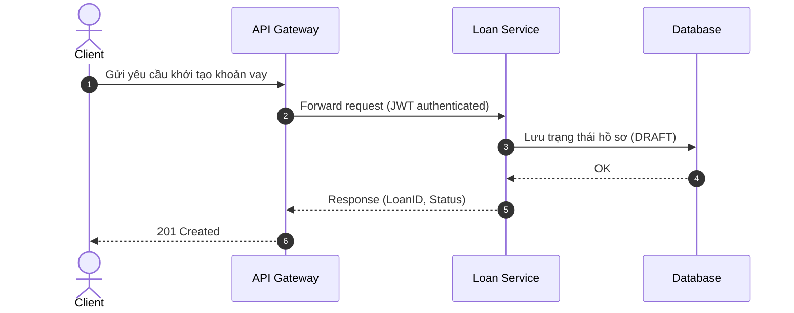

# Architecture

## High Level Architecture

```text
Client
   |
API Gateway
   |
Payment Service
   |
+---------------------+
| PostgreSQL          |
| Redis               |
| Kafka               |
+---------------------+

Payment Gateway
```

## Components

### REST API

External APIs.

### Business Layer

Payment processing logic.

### Repository Layer

Database access.

### Integration Layer

- Payment Gateway
- Kafka
- Notification

## Sequence Diagram

1. Receive payment request
2. Validate request
3. Call gateway
4. Persist transaction
5. Publish event
6. Return response


